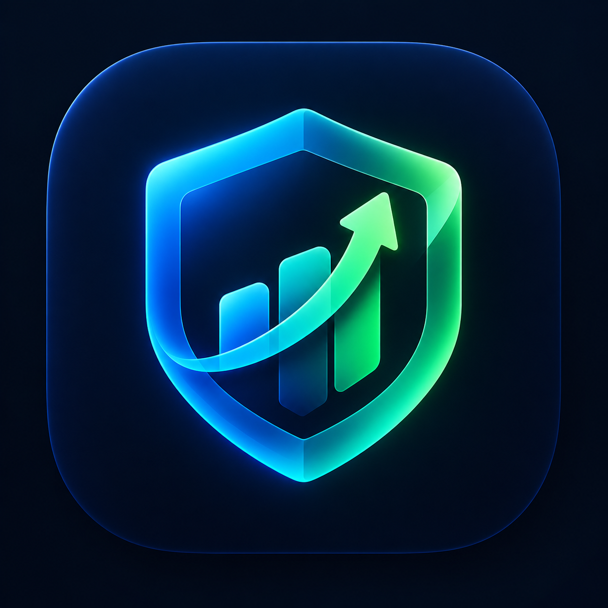

# MYFP — Financial Intelligence Suite

<p align="center">
  
</p>

<p align="center">
  <b>Piattaforma moderna e reattiva per il monitoraggio della finanza personale e la gestione patrimoniale.</b>
  <br />
  Disponibile come applicazione Desktop (Windows) e Mobile/Web (Expo / React Native).
</p>

---

## 🚀 Caratteristiche Principali

- **Regola Finanziaria 40/60 & Fondo Blindato**: Calcolo automatico della quota di risparmio blindata mensile ($40\%$) e del budget operativo spendibile ($60\%$), con parametri personalizzabili.
- **Estratto Conto Ufficiale in PDF**: Generazione istantanea di estratti conto mensili stile bancario in Dark Mode, completi di KPI, tabelle contabili e codici identificativi di audit.
- **Spedizione Email Automatica**: Composizione rapida tramite Gmail / app email di sistema con parametri e totali contabili precompilati.
- **Grafici Analitici Interattivi**:
  - *Istogramma comparativo*: entrate, risparmi e spese a confronto.
  - *Donut/Pie Chart*: suddivisione percentuale dinamica per categoria di spesa.
- **Parser Intelligente & OCR**: Acquisizione spese automatica analizzando il testo incollato o caricando screenshot di ordini e ricevute (tramite Tesseract OCR).
- **Importazione Movimenti via CSV**: Supporto per file estratti conto da qualsiasi banca, con categorizzazione automatica.
- **Simulatore d'Acquisto**: Valutazione in tempo reale dell'impatto di un acquisto sul budget rimanente prima di spendere.
- **Architettura Desktop Cross-Platform**: Interfaccia a 2 colonne ottimizzata per schermi PC tramite Electron.

---

## 📥 Download per Windows (.exe)

Per scaricare la versione eseguibile desktop per Windows:

1. Vai alla sezione [Releases](https://github.com/Z3nikYT/MYFP/releases).
2. Scarica:
   - **`MYFP Setup 1.0.0.exe`**: Programma di installazione con scorciatoie sul Desktop e nel Menu Start.
   - **`MYFP 1.0.0.exe`**: Versione *portable*, avviabile con doppio clic senza installazione.

---

## 🛠️ Stack Tecnologico

- **Frontend Core**: [React Native](https://reactnative.dev/) / [Expo](https://expo.dev/) (SDK 57)
- **Web Runtime**: `react-native-web`
- **Desktop Wrapper**: [Electron](https://www.electronjs.org/) & `electron-builder`
- **Stato Globale**: [Zustand](https://github.com/pmndrs/zustand) con persistenza locale asincrona
- **Backend & Autenticazione**: [Firebase](https://firebase.google.com/) (Google OAuth & Email/Password) + [Supabase](https://supabase.com/)
- **Visualizzazione Dati**: `react-native-chart-kit` & `react-native-svg`
- **Reportistica Documentale**: `expo-print` & `expo-sharing`

---

## 💻 Esecuzione in Locale

### Prerequisiti
- [Node.js](https://nodejs.org/) (versione 18 LTS o superiore)
- [Git](https://git-scm.com/)

### 1. Clonare il repository
```bash
git clone https://github.com/Z3nikYT/MYFP.git
cd MYFP
```

### 2. Installare le dipendenze
```bash
npm install
```

### 3. Avvio in modalità Web / Mobile
```bash
# Avvio server Expo (Web, Android, iOS)
npm run start

# Avvio diretto nel browser
npm run web
```

### 4. Avvio in modalità Desktop (Electron)
```bash
# 1. Esporta la build web
npm run build:web

# 2. Avvia la finestra Electron di sviluppo
npm run electron:start
```

### 5. Compilare il file `.exe` di produzione
```bash
npm run electron:build
```
I binari compilati verranno salvati all'interno della cartella `desktop-build/`.

---

## 🔒 Sicurezza & Privacy

I dati finanziari vengono gestiti secondo principi di privacy-first: salvataggio locale dei dati con crittografia e sincronizzazione sicura con Firebase. Nessun dato bancario o credenziale sensibile viene memorizzato in chiaro.

---

## 📄 Licenza

Progetto distribuito sotto licenza MIT. Consulta il file `LICENSE` per ulteriori dettagli.